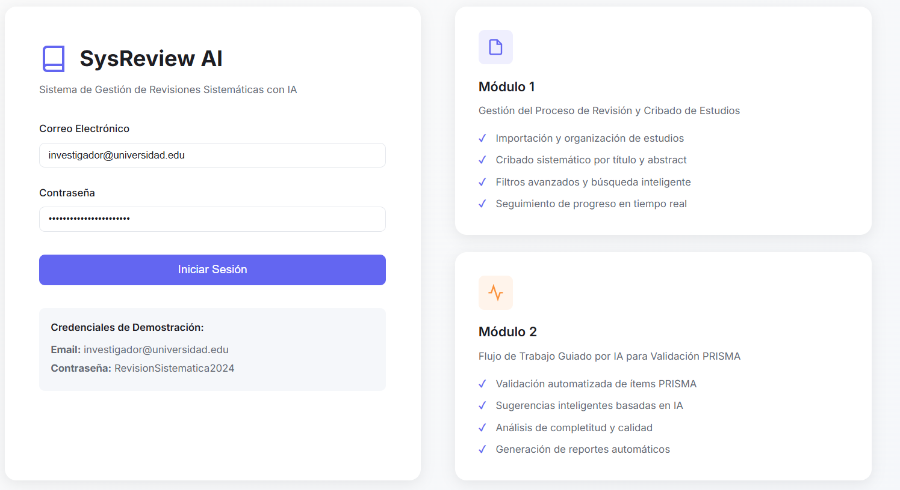
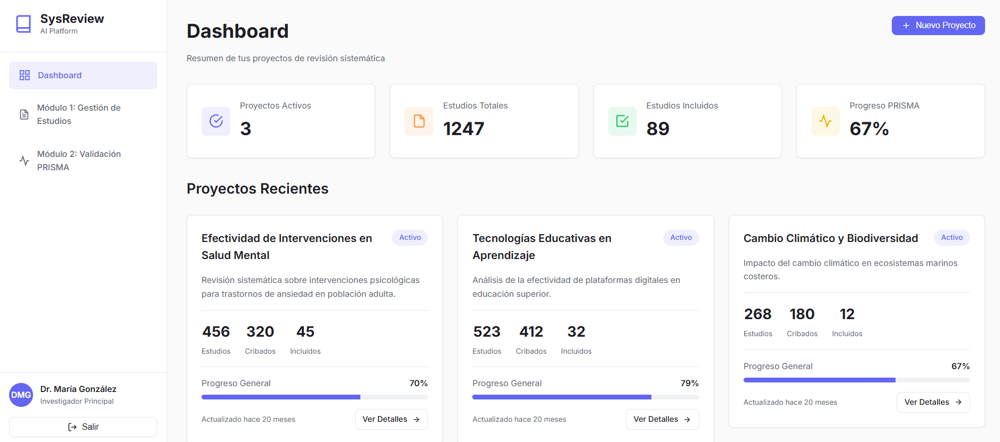

# Sistema Web para Revisiones Sistemáticas con IA

Este sistema permite gestionar y realizar revisiones sistemáticas de literatura científica, apoyando al investigador en la organización, búsqueda y análisis de artículos. Utiliza inteligencia artificial para facilitar la selección y evaluación de estudios relevantes.

## 🚀 Características principales

- **Autenticación de usuarios**  
  Acceso seguro mediante credenciales de demostración.

- **Panel principal**  
  Visualización y gestión de proyectos de revisión sistemática.

- **Soporte para IA**  
  Herramientas inteligentes para filtrar y analizar artículos científicos.

- **Interfaz intuitiva**  
  Navegación sencilla y diseño amigable para investigadores.

## 📷 Capturas de pantalla

- Acceso a la aplicación  
  

- Panel principal  
  

## 🛠️ Instalación y ejecución

1. Clona el repositorio:
   ```bash
   git clone https://github.com/Apgonzlez1/SistemaWebRSL-IA.git
   ```

2. Instala las dependencias:
   ```bash
   npm install
   ```

3. Ejecuta el sistema:
   ```bash
   npm run start
   ```

4. Accede desde tu navegador a [http://localhost:4200](http://localhost:4200)

## 👩‍💻 Credenciales de demostración

- **Usuario:** investigador@universidad.edu  
- **Contraseña:** RevisionSistematica2024

## 📄 Licencia

Este proyecto es de uso académico y experimental.

---

*Desarrollado por Apgonzlez1 y colaboradores.*